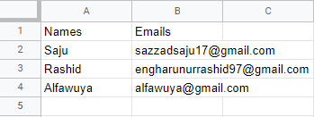
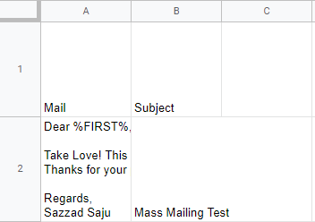
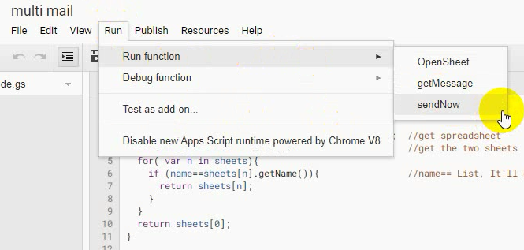
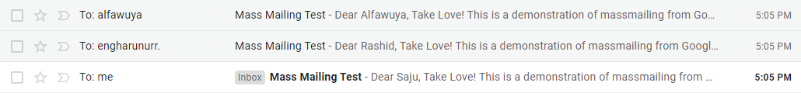

# Mass Mailing From Google Spread Sheets

**Send emails directly from Google spreadsheets using your Gmail A/C to all of the receiver listed on your sheet:**

In the case of mass mailing, using Gmail's Cc Bcc is a bad practice. That can send emails to everybody but all of the email addresses are exposed to everyone, that's a security threat. This script sends each email separately in an instance and no emails are revealed, plus we can send emails using a specific receiver's name that makes the email appealing. 

**Note**
- Google allows 100 emails a day per Gmail A/C
- Use multiple A/C to send if you have more than 100 mails
- Format spreadsheet like the MassMail.xlsx or change the code to work for you
- Google block this unrecognized app while running for the first time, give it access

# Screenshots
**List Sheet**

 

**Mail Sheet**

 

**Run sendNow() function to execute**

 

**Result**

 
